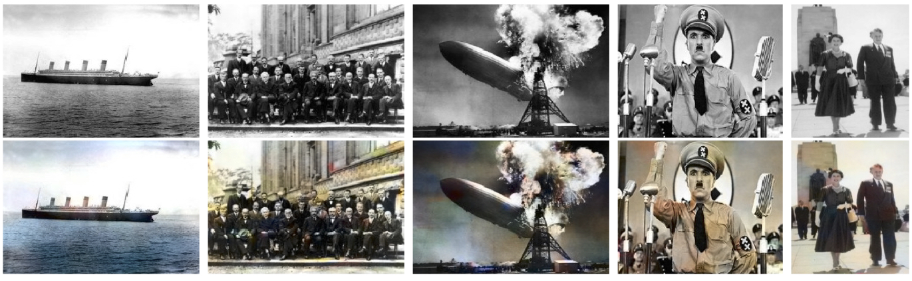

## Abstract
We review some of the most recent approaches to colorize gray-scale images using deep learning methods. Inspired by these, we propose a model which combines a deep Convolutional Neural Network trained from scratch with high-level features extracted from Inception-ResNet-v2 pre-trained model. Thanks to its fully convolutional architecture, our encoder-decoder model can process images of any size and aspect ratio. Other than presenting the training results, we assess the "public acceptance" of the generated images by means of a user study. Finally, we present a carousel of applications on different types of images, such as historical photographs.

## Authors

<table align="center">
      <tfoot>
        <tr>
          <th>
<a href="http://github.com/baldassarrefe">Federico Baldassarre</a>
</th>
          <th>
<a href="http://github.com/lucasrodes">Lucas Rodés-Guirao</a>
</th>
          <th>
<a href="http://github.com/diegomorin8">Diego González Morín</a>
</th>
        </tr>
      </tfoot>
      <tbody>
        <tr>
          <td></td>
          <td></td>
          <td></td>
        </tr>
      </tbody>
</table>

## Code
A TensorFlow/Keras implementation of Deep-Koalarization is available on [Github](https://github.com/baldassarrefe/deep-koalarization).

<a class="github-button" href="https://github.com/baldassarrefe/deep-koalarization" data-icon="octicon-star" data-size="large" data-show-count="true" aria-label="Star baldassarrefe/deep-koalarization on GitHub">Star</a>

## Paper

<pre><code> 
@inproceedings{deepkoal2017,
  author = {Baldassarre, Federico and Rodes-Guirao, Lucas and Gonzalez Moring, Diego},
  title = {Deep Koalarization: Image Colorization using CNNs and Inception-ResNet-v2},
  keywords = {Colorization, CNN, Inception-ResNet-v2, Transfer Learning, Keras, TensorFlow},
  booktitle = {to be updated},
  year = 2017,
  month = Dec
}
</code> </pre>

[arXiv preprint](https://github.com/baldassarreFe/deep-koalarization/blob/master/paper.pdf)

## Acknowledgement
We would like to thank Prof. [Josephine Sullivan](http://www.csc.kth.se/~sullivan/) for supervising our work. Furthermore, we also want to point out that our network was trained and tested using the Tegner nodes of the [PDC Center for High-Performance Computing](http://pdc.kth.se) at the [KTH Royal Institute of Technology](http://kth.se), leveraging the [NVIDIA® CUDA® Toolkit](https://dl.acm.org/citation.cfm?id=1365500) and the NVIDIA® Tesla® K80 Accelerator GPU to speed up the computations.

<blockquote class="twitter-tweet" data-cards="hidden" data-lang="en">
&mdash; Shu Uesugi (@chibicode) </blockquote>

<a href="https://github.com/baldassarrefe/deep-koalarization" class="github-corner"><svg width="80" height="80" viewBox="0 0 250 250" style="fill:#151513; color:#fff; position: absolute; top: 0; border: 0; right: 0;"><path d="M0,0 L115,115 L130,115 L142,142 L250,250 L250,0 Z"></path><path d="M128.3,109.0 C113.8,99.7 119.0,89.6 119.0,89.6 C122.0,82.7 120.5,78.6 120.5,78.6 C119.2,72.0 123.4,76.3 123.4,76.3 C127.3,80.9 125.5,87.3 125.5,87.3 C122.9,97.6 130.6,101.9 134.4,103.2" fill="currentColor" style="transform-origin: 130px 106px;" class="octo-arm"></path><path d="M115.0,115.0 C114.9,115.1 118.7,116.5 119.8,115.4 L133.7,101.6 C136.9,99.2 139.9,98.4 142.2,98.6 C133.8,88.0 127.5,74.4 143.8,58.0 C148.5,53.4 154.0,51.2 159.7,51.0 C160.3,49.4 163.2,43.6 171.4,40.1 C171.4,40.1 176.1,42.5 178.8,56.2 C183.1,58.6 187.2,61.8 190.9,65.4 C194.5,69.0 197.7,73.2 200.1,77.6 C213.8,80.2 216.3,84.9 216.3,84.9 C212.7,93.1 206.9,96.0 205.4,96.6 C205.1,102.4 203.0,107.8 198.3,112.5 C181.9,128.9 168.3,122.5 157.7,114.1 C157.9,116.9 156.7,120.9 152.7,124.9 L141.0,136.5 C139.8,137.7 141.6,141.9 141.8,141.8 Z" fill="currentColor" class="octo-body"></path></svg></a>

